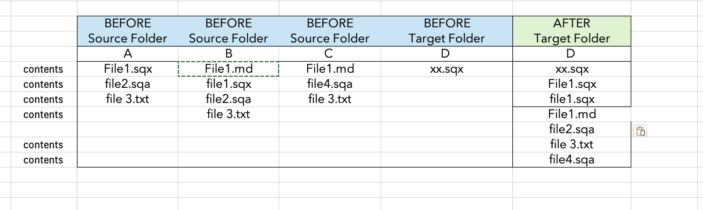

# SQX Folder Merge

Collect files from multiple source folders into one target folder so that the target contains exactly one copy of each uniquely-named file. Comparison is **case-sensitive**. Existing files in the target are never overwritten.



## Requirements

- Python 3.9 or later — no third-party packages needed
- Works on macOS and Windows

## Usage

### GUI

```
python3 folder_merge_ui.py
```

Set the number of source folders, browse or type each path, set the target folder, then click **Run Merge**.

### Command line

```
python3 folder_merge.py <target_folder> <source1> [source2 ...]
```

## Docs

- [User Guide](docs/SQX-Folder-Merge_UserGuide.md)
- [Specification](docs/SQX-Folder-Merge_Spec.md)
